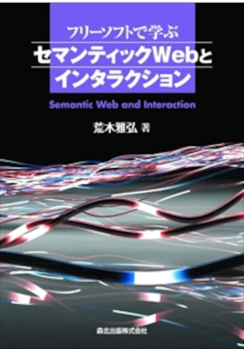

### 出版した本 📖

 <table style="border:none;">
    <tr>
      <td></td>
      <td></td>
      <td></td>
      <td></td>
      <td></td>
    </tr>
 </table>

 ### リカレント教育のコース 🏫

- [機械学習基礎・応用](https://github.com/MasahiroAraki/MLCourse)
- [高等学校 情報I準拠 「情報の基本」](https://github.com/MasahiroAraki/Informatics-I)
